# ING301 Prosjekt - Del A: SmartHus Domenemodell

## Oversikt

Dette prosjektet implementerer en domenemodell for et SmartHus-system.
Systemet lar deg registrere etasjer, rom og smarte enheter (sensorer og aktuatorer) i et hus,
og tilbyr funksjonalitet for å hente informasjon om og styre disse enhetene.

## Mappestruktur

```
.
├── README.md
├── domainmodel/               <- Klassediagram over domenemodellen
├── smarthouse/
│   └── domain.py              <- Alle klasser og logikk for SmartHus-systemet
└── tests/
    ├── demo_house.py          <- Demohus med etasjer, rom og enheter
    └── test_part_a.py         <- Enhetstester for del A
```

## Domenemodell

Systemet består av følgende klasser:

- **`SmartHouse`** – Hovedklassen. Holder styr på etasjer, rom og enheter.
- **`Floor`** – Representerer en etasje med et nivånummer og en liste med rom.
- **`Room`** – Representerer et rom med areal, valgfritt navn og en liste med enheter.
- **`Device`** – Basisklasse for alle smarte enheter. Har `id`, `device_type`, `supplier` og `model_name`.
- **`Sensor`** – Arver fra `Device`. Lagrer målinger og tilbyr `last_measurement()`.
- **`Actuator`** – Arver fra `Device`. Kan slås av/på med `turn_on()` / `turn_off()` og støtter en valgfri målverdi.
- **`Measurement`** – Representerer en enkelt måling med verdi, enhet og tidspunkt.

